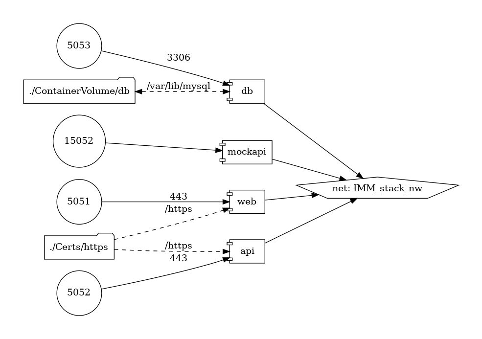

# iMacloud-App
本 Repo 底下的專案相容於 iMacloud 專案 App 開發的 SOP

- 智慧機械雲   https://portal.imacloud.com.tw/
- 標準 Runtime 環境操作與開發手冊 (2022.06.30)
- iMacloud：2.19.5
- 地端引擎 imc-agent：12.1

### IMM-ADX-Lite ( Trial Mode : Offline )

- 該項目創建一個數據源DataSource，例如 : OPC UA 和 Modbus。

- Azure 數字孿生定義語言 (DTDL)，進行Web交互式圖表的動態映射Mapping。

- IMM-ADX-Lite 試用版 Trial 提供  2 hour 運行測試。 

- MockAPI 提供預先建立的 offline 離線版 Azure Digital Twins 的測試功能。

- 透過 IMM-ADX-Lite.zip 封裝格式，將App上架至 iMacloud 智慧機械雲平台。

- IMM-ADX-Lite安裝 成為 iMaCloud App。
  
  
  
  
- IMM-ADX-Lite微服務網路架構圖
  
  
- 本地端容器化入口網址為 :  https://localhost:5051/
  
  這裡我們使用 Host 電腦上的 OPC UA 模擬器 IMM_SimServer ( opc.tcp://localhost:6102)，因為 docker network 採取 bridge模式，小技巧提示，建議在此輸入將"localhost"替換為"host.docker.internal"。
  
  
  
  
  
- Datasource mapping 提供匯入 CSV 及匯出 CSV。
  
  
  
  
  
- 執行一個您自己的OPC UA Server 資料來源 (例如 : IMM SimServer)。

  
  
  
  
- 本地端容器化 REST API 網址為 :  https://localhost:5052/swagger/index.html

  

  

- 在 Azure Digital Twins Explorer 中的 DTDL V2模型，包含 Model & Twins的建立。實務上需要熟悉 Azure ADT 相關的雲端與數位孿生的技術，IMM-ADX-Lite 先將 ADT 雲端服務建立在本地 offline 運行，透過模擬方式搭建多租戶的 FakeAPI 先降低入門的門檻。

