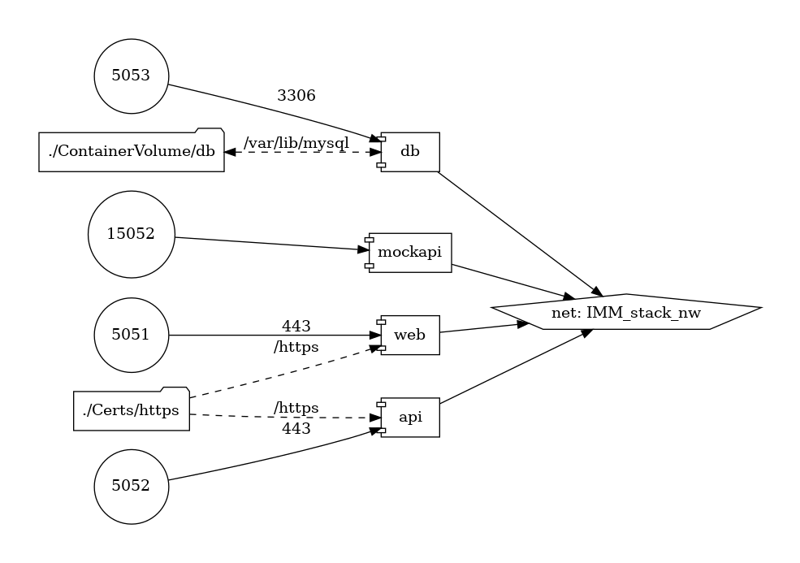
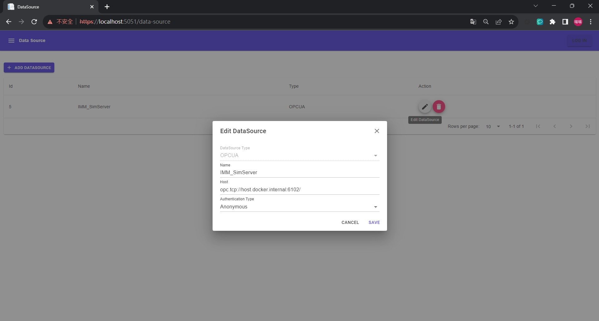
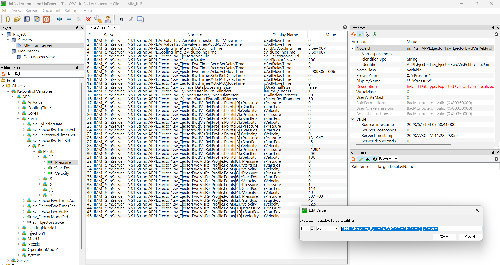

# iMacloud-App
本 Repo 底下的專案相容於 iMacloud 專案 App 開發的 SOP

- 智慧機械雲   https://portal.imacloud.com.tw/
- 標準 Runtime 環境操作與開發手冊 (2022.06.30)
- iMacloud：2.19.5
- 地端引擎 imc-agent：12.1

### 01. IMM-ADX-Trial ( Offline 版本)

- 該項目創建一個數據源DataSource，例如 : OPC UA 和 Modbus。

- Azure 數字孿生定義語言 (DTDL)，進行Web交互式圖表的動態映射Mapping。

- Trial 試用版提供  2 hour 運行測試。 

- MockAPI 提供預先建立的離線版 Azure Digital Twins 的測試功能。

- IMM-ADX-Trial.zip 上架 App到 iMacloud App 智慧機械雲平台 runtime 封裝使用。

- IMM-ADX-Trial 安裝 成為 iMaCloud App
  
  
- IMM-ADX-Trial 微服務網路架構圖
  
  
- 本地端容器化入口網址為 :  https://localhost:5051/
  
  
  
  Datasource mapping 提供匯入 CSV 及匯出 CSV   
  
  
  
- 執行一個您自己的OPC UA Server 資料來源 (例如 : IMM SimServer)

  
  
- 本地端容器化REST API 網址為 :  https://localhost:5052/swagger/index.html

  

- 在 Azure Digital Twins Explorer 中的模型

